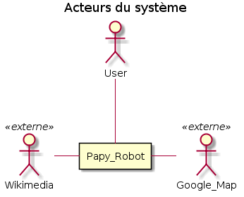

# Analyse Fonctionnelle

## User Stories

* En tant que utilisateur je veux poser une question afin que Papy Robot me réponde
* En tant que utilisateur je veux utiliser un langage courant afin que le dialogue semble le plus réaliste possible
* En tant que développeur je veux afficher une plan google map afin que la réponse soit visuelle
* En tant que développeur je veux afficher un message issue de Wikipedia afin que la réponse soit plus complète
* En tant que développeur je veux utiliser le TDD afin de pouvoir faire de l'intégration continue
* En tant que développeur je veux que les questions et les réponses se déroulent sans chargement de nouvelle page afin que l'expérience utilisateur soit la plus naturelle et agréable

## Règles fonctionnelles

L'application est dans un navigateur web. l'utilisateur utilise un formulaire pour poser sa question et valide avec entrée.

Sans recharger la page, les questions et les réponses s'enchaine à la maniére d'une messagerie instantanée.

La question est analysée à partir de mots clés afin de réaliser une recherche via l'API de Google Map afin de récuperer une adresse un plan et une autre recherche via l'API de Wikimedia afin de récupérer le 1er paragraphe correspondant à l'adresse trouvée.

Si la recherche ne donne pas de résultat concluant, un message indiquant que la demande n'est pas claire est renvoyée à l'utilisateur.

## Acteurs système

## Décomposition du système

## Cas d'utilisation

## Cycle de vie
Diagramme d'activité

## Description du domaine fonctionnel

Diagramme de CLasses

## Description des composants du système

Diagramme de composatns

## Déploiement

Diagramme de déploiement