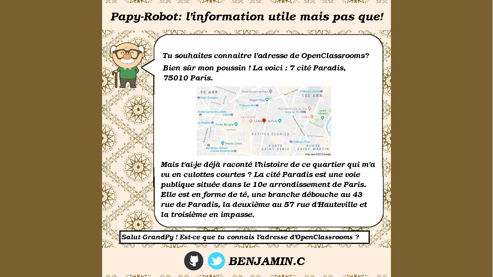
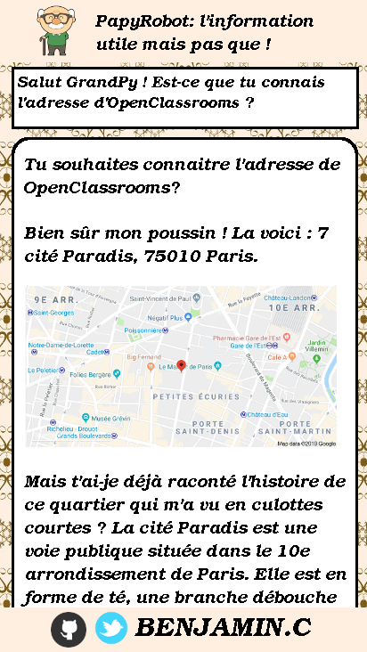

# Créez GrandPy Bot, le papy-robot 🤖 👴

Github : https://github.com/Zepmanbc/oc_dapython_pr7

Trello : https://trello.com/b/Wh1dkH9n/ocdapythonpr7

Lien Heroku : https://bc-ocdapythonpr7.herokuapp.com/

[Analyse Fonctionnelle](https://github.com/Zepmanbc/oc_dapython_pr7/blob/master/doc/analyse_fonctionelle.md)

# Démarche

## Front

Réalisation d'une maquette pour la version écran d'ordinateur et de smartphones.

[version ordinateur format GIMP](https://github.com/Zepmanbc/oc_dapython_pr7/raw/master/doc/front/version_ordi.xcf)

[version smartphone format GIMP](https://github.com/Zepmanbc/oc_dapython_pr7/raw/master/doc/front/version_mobile.xcf)

## Déploiement sur Heroku

Création du fichier Procfile

Clonage du repo dans heroku

    heroku git:clone -a bc-ocdapythonpr7

pour pousser le projet vers heroku

    git push heroku master

mise en place du déploiement automatique depuis github après [validation de Travis](https://www.travis-ci.org/Zepmanbc/oc_dapython_pr7) et de [l'analyse de couverture](https://coveralls.io/github/Zepmanbc/oc_dapython_pr7)

## Flask et le TDD

définition d'une liste de phrases à tester:

* Salut GrandPy ! Est-ce que tu connais l'adresse d'OpenClassrooms ?
* où se trouve l'Arc de Triomphe?
* Quelle est l'adresse de la Tour Eiffel?
* Dis Papy, c'est quoi l'adresse de l'Elysée?
* Tu connais l'adresse de l'Opéra Garnier?

Rédaction des pages de tests puis codage des modules pour obtenir des tests vert.

## API Google Map et Wikimedia

### Google Map

Création de l'identifiant sur https://console.cloud.google.com

Création de la variable d'environnement dans l'environnement virtuel

    pipenv shell
    echo "GMAPKEY=[PRIVATE_KEY]" > .env
    echo $GMAPKEY

Création de la variable d'environnement dans Heroku

    heroku config:set GMAPKEY=[PRIVATE_KEY]

Utilisation du paquet googlemaps : https://github.com/googlemaps/google-maps-services-python

Utilisation de l'API geocode pour récupérer:

* l'adresse complète => afficher dans la réponse
* les coordonnées GPS => pour générer la carte
* une combinaison nom de rue + ville => requête wikipedia

### Wikipedia

Utilisation du paquet MediaWiki https://github.com/zikzakmedia/python-mediawiki

Récupération du contenu de la page (*content*) et découpage de la partie souhaitée => afficher dans la réponse